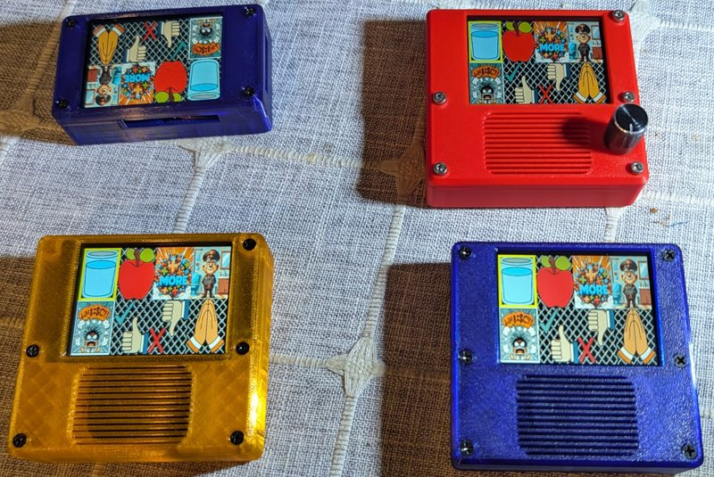
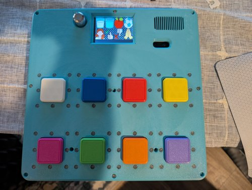
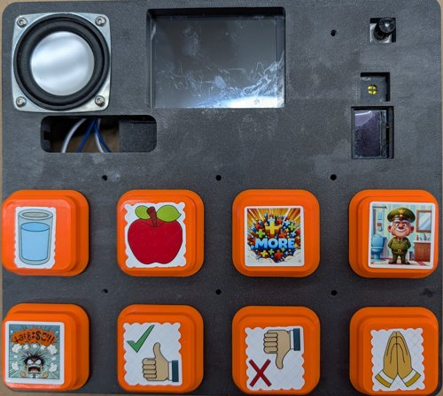
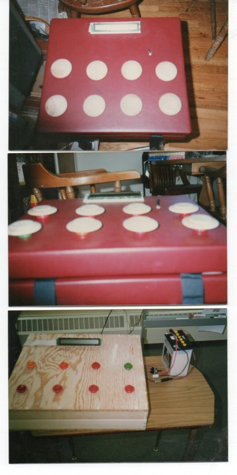

# T-Rex Talk — AAC Communication Device

An open-source Augmentative and Alternative Communication (AAC) device
that helps people communicate by pressing pictures on a screen. When a
picture is pressed, the device speaks a word or phrase out loud.

**No programming knowledge needed.** Teachers and parents customize
the device by editing simple text files.


*Four T-Rex Talk devices in custom 3D printed cases — touch screen and encoder variants*

<table>
<tr>
<td><br><em>Button + LCD variant</em></td>
<td><br><em>Picture button variant</em></td>
</tr>
</table>

> **Build your own!** See the [Build-a-Box photo album](https://photos.app.goo.gl/G9FtMMnnMuZ1zZxx8) for step-by-step 3D printing and assembly photos.

## Quick Start

1. **Flash CircuitPython** onto a supported device ([SETUP.md](SETUP.md))
2. **Copy the installer** to an SD card ([installer/README.md](installer/README.md))
3. **Insert SD card and reboot** — auto-configures everything
4. **Customize** menus and sounds ([GUIDE_FOR_TEACHERS.md](GUIDE_FOR_TEACHERS.md))

## Supported Devices

| Device | Screen | Input | Best For |
|--------|--------|-------|----------|
| **CYD_PLUS** | 320×240 color touch | Touch screen | Primary AAC device |
| **Fruit Jam** | 160×128 color LCD | Rotary encoder | Compact, low-power |
| **OLED Badge** | 128×32 mono OLED | Rotary encoder | Wearable, text-only |
| **Feather RP2350** | 320×240 color LCD | 8 physical buttons + encoder | Physical button access |

## Features

- **Picture-based communication** — touch or press to speak
- **Menu system** — organize vocabulary into topic boards
- **Emergency button** — instant help message on hold (~1.2 seconds)
- **Configurable** — volume, speed, sleep, encoder direction via config.txt
- **Multi-language** — bilingual support (tested with Thai/English)
- **Playback speed** — slow down speech for pre-verbal learners
- **Sleep/wake** — battery-friendly power management
- **SD card installer** — auto-detects board and configures device

## Documentation

| Document | Audience |
|----------|----------|
| [SETUP.md](SETUP.md) | Setting up a new device |
| [GUIDE_FOR_TEACHERS.md](GUIDE_FOR_TEACHERS.md) | Teachers and parents — customizing menus and sounds |
| [user_manual/USER_MANUAL.html](user_manual/USER_MANUAL.html) | End users — daily operation guide |
| [menu_system.md](menu_system.md) | Technical — menu file format reference |
| [HISTORY.md](HISTORY.md) | Project version history |
| [NOTES.md](NOTES.md) | Development notes and future plans |
| [Credits.md](Credits.md) | Contributors and acknowledgments |

## Project Structure

```
code.py                 ← Entry point
machine.py              ← Main orchestrator
hardware_config.py      ← Device variant definitions
config.txt              ← User settings (per device)
display_manager.py      ← Display drivers (ILI9341, ST7735R, SSD1306)
audio_player.py         ← MP3/WAV playback with speed control
input_manager.py        ← Touch, encoder, I2C buttons
sleep_manager.py        ← Power management
menu_parser.py          ← .menu file reader
action.py               ← Press actions (sound, image, vibrate, navigate)
config_reader.py        ← config.txt parser
storage_manager.py      ← SD card support

menus/                  ← Menu definitions (.menu files)
    images/             ← Button images
    sounds/             ← Sound files
button_sounds/          ← Base menu sounds
installer/              ← SD card auto-installer
user_manual/            ← HTML user manual with images
original_icons/         ← Source icon library
```

## Configuration (config.txt)

```
volume = 80
playback_speed = 100
sleep_timeout = 120
start_menu = base.menu
emergency_push_enabled = true
encoder_direction_flip = false
```

See [GUIDE_FOR_TEACHERS.md](GUIDE_FOR_TEACHERS.md) for all settings.

## Contributing

See [help_wanted.md](help_wanted.md) for ways to contribute:
- Software engineers
- 3D designers
- Special needs experts
- Symbol/icon designers
- Web developers

## License

MIT License — see [LICENSE](LICENSE)

## Project History

This project began in the early 1990s when Michael Kadie built two speech
boards for children with special needs.



*The original speech boards (1990s) — inspiration for T-Rex Talk*

See [HISTORY.md](HISTORY.md) for the full version history from V0.x to V3.0.

## Credits

Created by Michael Kadie. See [Credits.md](Credits.md) for full acknowledgments.

---

*T-Rex Talk: Giving a voice to those who need one.*
