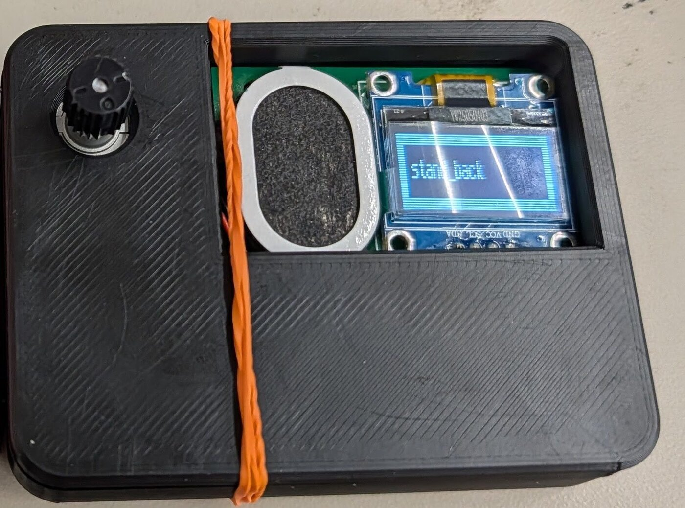
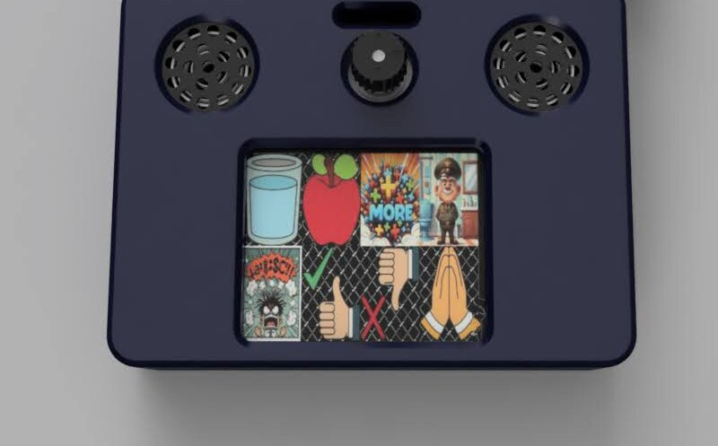

# T-Rex Talk — Involuntary Non-Verbal Variant (MVP)

> The clinical name for this condition is **selective mutism**. The people I
> talked to prefer **involuntary non-verbal**, because it names the
> truth of the experience: the silence is not a choice. This document uses
> *involuntary non-verbal* throughout.

This is the smallest member of the T-Rex Talk family — small enough to live
in a pocket, ready the moment the words won't come. We call it the **MVP**:
it's the *minimum viable product*, and it's also the *minimum viable hardware*
— the smallest useful build of the device. Every other T-Rex Talk variant is
this same module with more hardware added around it.

<table>
<tr>
<td> <em>The working pocket Talker today — rotary encoder, speaker, and a small screen showing the emergency <strong>"stand back"</strong> message. Hand-built and already in real use.</em></td>
<td> <em>The V3 MVP we're building now — the same software in a refined pocket body. Rotary encoder by default, with an optional touch screen (shown here).</em></td>
</tr>
</table>

---

## If this is you

You can speak. You have the words. You know exactly what you want to say.

And then — in the classroom, at the counter, when someone you don't know turns
and asks you a question — your voice locks. Not because you're shy, not because
you're being difficult, not because you don't want to answer. Your body simply
won't let the sound out. The harder the moment presses on you, the tighter the
lock gets. People crowd in, repeat the question louder, wait with that look on
their faces, and all of that makes it worse, not better.

That freeze is involuntary. It is real, it is exhausting, and it is **not your
fault.**

This device exists so that in those moments you don't have to win a fight with
your own voice. You press a button; it speaks for you. That's the whole idea.

## We need your help to make it better

We can design the hardware and write the software, but we cannot live your
moments for you — and that's the part that matters most. **You are the expert
on this condition.** The phrases that actually save a situation, the wording of
the emergency message, how fast it needs to wake, what makes a device feel safe
to pull out in public versus what makes it worse — those answers live with the
people who experience the freeze, not with us.

So please tell us. What helps. What doesn't. What you wish it said. What you'd
never use. Your personal preferences and your hard-won experience don't just
improve *your* device — every honest piece of feedback makes the device better
for everyone who comes after you. This is built *with* the community it's for,
not just *for* it.

## What it does

- **Speaks your phrases.** Load the things you most often need to say but can't
  always get out — *"Yes," "No," "I need a minute," "Can you write it down?",*
  whatever your moments actually call for — and reach them in a press or two.
- **Yours to operate.** You choose the phrases, you decide when it speaks, you
  carry it. Unlike the variants set up by a caregiver, this one needs no one
  standing next to you for it to work.
- **Has an emergency message.** Hold the button and it plays a phrase that
  explains the situation to the people around you when you can't:
  > *"Please stand back. I cannot speak right now, but I am OK. Crowding me
  > makes it worse. Thank you."*
  You can change the wording to your own. It works the instant you hold the
  button — even straight out of sleep — so it's there in the hardest moment.
- **Doesn't require fine motor control to use in a crisis.** When the freeze hits
  hardest, precise movements are the first thing to go. You don't need them
  here. There's no exact spot to find, no small target to hit, no menu to
  navigate first. You can simply **smack the button and hold it down**, and the
  device gives the people around you their instructions. A panic response is
  enough to work it.
- **Wakes the moment you need it and rests the rest of the time.** This is an
  **as-needed** device, not an always-on one. It spends most of the day asleep,
  wakes the instant you reach for it, speaks, and goes back to sleep. Because it
  only has to be ready for the moments that matter rather than running all day,
  it carries a **smaller battery** — less weight and bulk in your pocket for the
  same real-world readiness.

## Same software as every other T-Rex Talk

This is not a stripped-down or "lite" version. The MVP runs the **exact same
T-Rex Talk firmware** as the full-size touch devices and the button boards —
the same menu system, the same configurable phrases, the same emergency
feature, the same settings file. Nothing is missing in software.

What's different is that the hardware is **tuned for pocketability and
occasional use** instead of all-day desktop use. Same brain, smaller body.

## The hardware, briefly

- **Input — a rotary encoder, by default.** One small dial you turn to move
  through your phrases and press to speak. It's discreet, it's hard to trigger
  by accident in a bag, and it needs almost no power. That's the standard build.
- **Touch screen — optional.** If you'd rather tap than turn, the same module
  can drive a touch screen instead. See the **[Build-a-Box photo
  album](https://photos.app.goo.gl/G9FtMMnnMuZ1zZxx8)** for how the touch-screen
  build goes together.
- **A small display and a speaker**, sized for a thing you hold in one hand.
- **Battery powered**, charged over USB-C, sized for as-needed use as described
  above.

For the full hardware specification — the custom RP2350 module, the low-power
companion processor, the connectors — see
[`custom_processor_description.md`](./custom_processor_description.md).

## The core that everything is built on

Here's why this particular variant is also the *minimum* one.

If your only barrier is the involuntary speech block — you can see the screen,
read the words, reach the dial, and carry the device — then you need **the least
hardware of anyone.** This bare module is already enough for you.

Other people need more: a bigger display, large physical buttons, a sip-and-puff
straw, a switch, a head-pointer. Those are all just **more hardware added onto
this same module.** The MVP plugs into a *carrier board* that supplies whatever
extra input or output that person needs, and the same software adapts to it.

So this variant sits at the core of the whole family — the smallest useful
build, and the core everything else is built on. That's the double meaning
of MVP.

## Where the project is, and how to get involved

The T-Rex Talk project (branded **R.O.A.R. — Rex's Open Assistive Resources**)
is actively recruiting a test group of **involuntary non-verbal individuals** to
help shape this device, and working toward a small production run.

- **Get involved or learn more:** [tssfaa.com](https://tssfaa.com)
- **Build your own:** [Build-a-Box photo
  album](https://photos.app.goo.gl/G9FtMMnnMuZ1zZxx8)
- **Source, hardware, and docs:** [mkadie/NeedsBoard](https://github.com/mkadie/NeedsBoard)

This is open-source and built by people who believe a locked voice deserves a
way out. If that's you, or someone you care about, we'd like to hear from you.

---

*T-Rex Talk: giving a voice to those who need one.*
